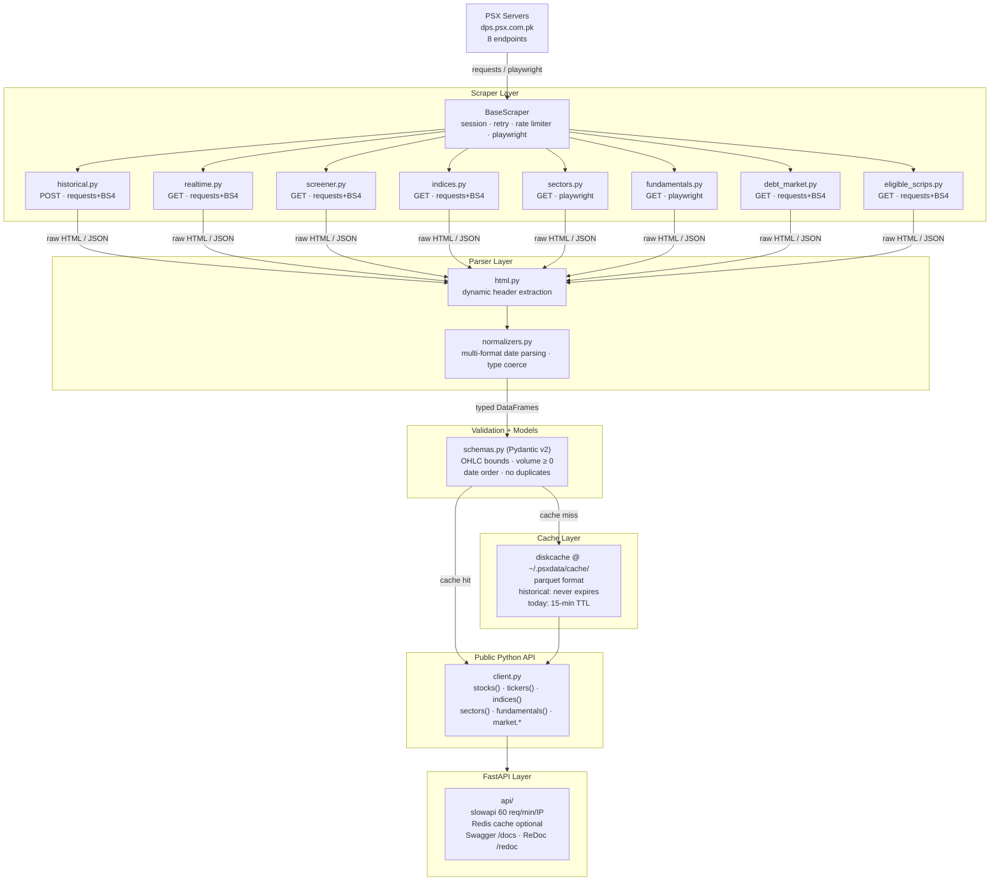
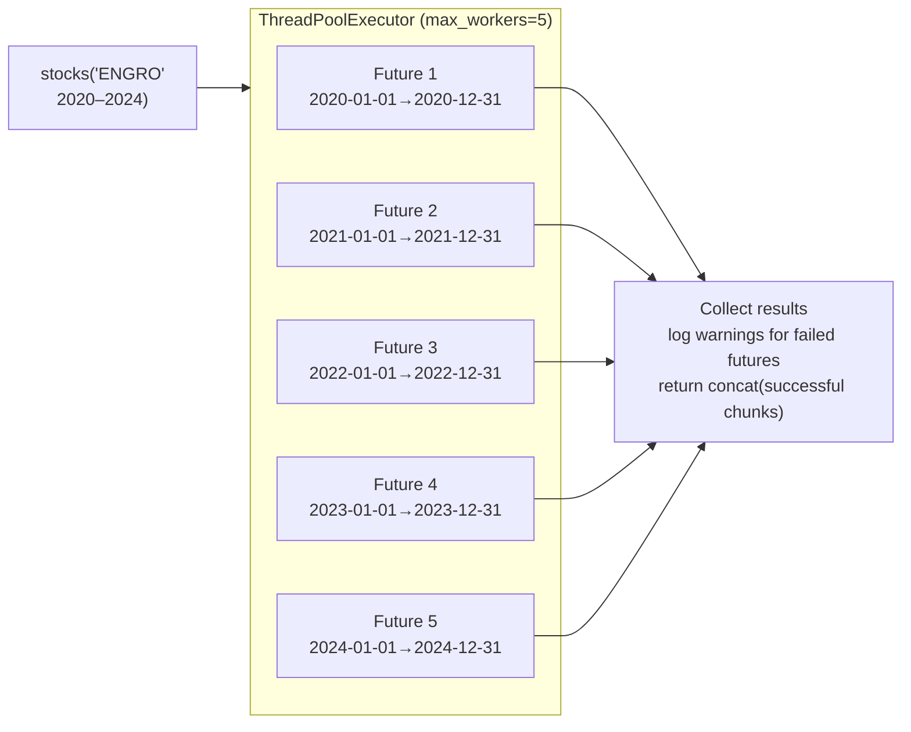

# Architecture — psxdata

`psxdata` is a production-grade data pipeline with two consumer surfaces: a **Python library** (yfinance-style API) and a **FastAPI REST service**. It scrapes 8 PSX endpoints, normalizes and validates the data, caches it on disk, and exposes it through clean interfaces.

The hardest constraints are external: PSX is an unstable third-party dependency that changes HTML structure without notice, throttles aggressive scrapers, and requires JavaScript rendering on two of its endpoints.

---

## Component Diagram



---

## Data Flow

```
PSX Server → Scraper → Parser → Validator → Cache → Public Python API → FastAPI
```

On a cache hit, the path short-circuits after the Cache layer and never touches the Scraper.

---

## Directory Structure

```
psxdata/
├── psxdata/                    # Installable Python package (pip install psxdata)
│   ├── __init__.py             # Public API exports: stocks, tickers, indices, sectors, fundamentals, market
│   ├── client.py               # PSXClient — orchestrates scrapers, cache, validation
│   ├── constants.py            # All constants — no magic numbers anywhere in the codebase
│   ├── exceptions.py           # Custom exceptions: PSXUnavailableError, ParseError, ValidationError
│   ├── utils.py                # Date range chunking, rate limiter, shared helpers
│   ├── scrapers/
│   │   ├── base.py             # BaseScraper: session, retry, rate limit, playwright instance
│   │   ├── historical.py       # POST /historical — OHLCV data
│   │   ├── realtime.py         # GET /trading-panel — live quotes
│   │   ├── indices.py          # GET /indices — index values and history
│   │   ├── sectors.py          # GET /sector-summary — sector aggregates (JS-rendered)
│   │   ├── fundamentals.py     # GET /financial-reports — P/E, EPS, book value (JS-rendered)
│   │   ├── screener.py         # GET /screener — all listed tickers
│   │   ├── debt_market.py      # GET /debt-market — TFCs, Sukuks
│   │   └── eligible_scrips.py  # GET /eligible-scrips — margin trading eligible stocks
│   ├── parsers/
│   │   ├── html.py             # Dynamic <th> header extraction, never fixed column positions
│   │   └── normalizers.py      # parse_date_safely(), type coercion, column name normalization
│   ├── cache/
│   │   └── disk_cache.py       # diskcache wrapper, parquet format, TTL logic
│   └── models/
│       └── schemas.py          # Pydantic v2 models for all data types
├── api/                        # FastAPI REST service (optional, pip install psxdata[api])
│   ├── main.py                 # FastAPI app entrypoint, CORS, rate limiting setup
│   ├── routers/                # One router per data type, mirrors psxdata public API
│   ├── dependencies.py         # Shared FastAPI dependencies (cache, rate limiter)
│   └── schemas.py              # Request/response Pydantic models
├── tests/
│   ├── unit/                   # Fast, no network — parsers, validators, cache, utils
│   ├── integration/            # Real PSX endpoints — marked @pytest.mark.integration
│   ├── fixtures/               # HTML snapshots from PSX endpoints (captured in Phase 0)
│   └── conftest.py             # Shared fixtures
├── docs/
│   └── PSX_ENDPOINTS.md        # Live endpoint verification results from Phase 0
├── .github/
│   ├── ISSUE_TEMPLATE/         # bug_report, feature_request, task, endpoint_change
│   ├── workflows/
│   │   ├── ci.yml              # lint + unit tests on every PR (Python 3.11, 3.12)
│   │   ├── integration.yml     # integration tests nightly + manual dispatch
│   │   └── publish.yml         # PyPI publish on tag v*
│   └── pull_request_template.md
├── ARCHITECTURE.md             # This file
├── CONTRIBUTING.md             # Setup, branch naming, PR process, issue-first policy
├── CODE_OF_CONDUCT.md          # Contributor Covenant v2.1
├── CHANGELOG.md                # Keep a Changelog format
├── SECURITY.md                 # Private vulnerability disclosure
├── LICENSE                     # MIT
├── pyproject.toml              # Package metadata, dependencies, tool config
└── docker-compose.yml          # Run the FastAPI service locally
```

---

## Scraper → Endpoint Map

| Scraper | PSX Endpoint | HTTP Method | Mode |
|---|---|---|---|
| `historical.py` | `/historical` | POST | `requests` + BeautifulSoup |
| `realtime.py` | `/trading-panel` | GET | `requests` + BeautifulSoup |
| `screener.py` | `/screener` | GET | `requests` + BeautifulSoup |
| `indices.py` | `/indices` | GET | `requests` + BeautifulSoup |
| `sectors.py` | `/sector-summary` | GET | `playwright` (JS-rendered) |
| `fundamentals.py` | `/financial-reports` | GET | `playwright` (JS-rendered) — empty table observed in Phase 0 |
| `debt_market.py` | `/debt-market` | GET | `requests` + BeautifulSoup |
| `eligible_scrips.py` | `/eligible-scrips` | GET | `requests` + BeautifulSoup |

**Do NOT use:** `www.psx.com.pk/*` or `dps.psx.com.pk/timeseries/eod` — broken/redirect.

---

## Concurrent Historical Fetching

Date ranges are split into year-sized chunks and fetched in parallel:



Per-future exception handling means one failed chunk cannot kill the whole operation.

---

## Key Components

### BaseScraper (`psxdata/scrapers/base.py`)

Every scraper inherits from `BaseScraper`. Provides:

- Persistent `requests.Session` with headers: `User-Agent`, `Accept`, `Accept-Language`, `Referer`, `X-Requested-With`
- Exponential backoff retry: 3 attempts, delays 1s / 2s / 4s
- Rate limiter: max 2 requests/second
- Rotating User-Agent headers
- 30s timeout on every request
- `logging` at DEBUG level on every meaningful step
- Playwright browser instance for JS-rendered pages

### Caching (`psxdata/cache/disk_cache.py`)

- Library: `diskcache`
- Location: `~/.psxdata/cache/`
- Format: parquet (fast, compressed, preserves dtypes)
- Cache key: `f"{symbol}_{start}_{end}"`
- Historical data: never expires
- Today's data: 15-minute TTL

### Parser Layer

- `html.py` — extracts `<th>` tags dynamically; never assumes fixed column count or position
- `normalizers.py` — multi-format date parsing with `dateutil` fuzzy fallback; type coercion

### FastAPI Layer (`api/`)

```
GET  /health
GET  /stocks                                    # all tickers
GET  /stocks?index=KSE-100
GET  /stocks/{symbol}/historical?start=&end=
GET  /stocks/{symbol}/quote
GET  /stocks/{symbol}/fundamentals
GET  /indices
GET  /indices/{name}/historical?start=&end=
GET  /sectors
GET  /sectors/{name}/stocks
GET  /debt-market
GET  /eligible-scrips
```

All responses: `{"data": ..., "meta": {"timestamp": ..., "cached": bool}}`

Rate limit: 60 req/min per IP via `slowapi`. CORS: all origins. No auth required.

---

## Dependency Overview

```toml
# Core (always installed)
requests        # HTTP client for plain PSX endpoints
httpx           # Async HTTP (future use)
beautifulsoup4  # HTML table parsing
lxml            # BS4 parser backend
pandas          # DataFrame output format
python-dateutil # Fuzzy date parsing fallback
tqdm            # Progress bars for concurrent fetches
diskcache       # Disk-based cache
pydantic        # Data validation and models
playwright      # Headless Chromium for JS-rendered endpoints

# api extra (pip install psxdata[api])
fastapi         # REST framework
uvicorn         # ASGI server
slowapi         # Rate limiting for FastAPI
redis           # API-level response cache (optional, falls back to in-memory)

# dev extra (pip install psxdata[dev])
pytest          # Test runner
pytest-cov      # Coverage reporting
pytest-asyncio  # Async test support
httpx           # FastAPI TestClient
ruff            # Linter
mypy            # Type checker
```

---

## Failure Modes & Mitigations

| Failure | Mitigation |
|---|---|
| PSX changes HTML structure | Dynamic `<th>` header extraction; log warning on unknown columns; open `endpoint_change` GitHub issue |
| PSX changes date format | Multi-format fallback + dateutil fuzzy parsing in `parse_date_safely()` |
| Network timeout / 5xx | 3-attempt exponential backoff (1s / 2s / 4s); per-chunk isolation in ThreadPoolExecutor |
| IP rate-limited by PSX | Max 2 req/sec global rate limiter; max 5 concurrent workers |
| JS page load timeout | Playwright timeout config; graceful fallback to empty result + warning |
| Redis unavailable | Silent fallback to in-memory cache + warning log |
| Corrupt / anomalous OHLC data | OHLC + volume + date validators; warn and keep partial rows; drop only if fully corrupt |

---

## Design Decisions & Trade-offs

**Playwright for two endpoints only, not all.** JS rendering launches a Chromium process — expensive. Confining it to `/sector-summary` and `/financial-reports` keeps the common case (historical fetches) fast. Trade-off: two separate fetch paths to maintain.

**ThreadPoolExecutor over asyncio.** Simpler error isolation per future; `requests` is synchronous. Trade-off: each worker holds an OS thread; fine at max 5, would need rethinking at 50+.

**diskcache + parquet, not a database.** Historical stock data is immutable once a date passes. Parquet is compact and fast for DataFrame round-trips. Trade-off: no query capability beyond key lookup — filtering happens in pandas post-load.

**Redis is optional.** API falls back to in-memory cache when Redis is unavailable. Frictionless local development. Trade-off: in-memory cache is per-process and dies on restart — adequate for dev, not for multi-worker production deployments.

**No auth on the public API.** PSX data is public; adding auth creates friction with no security benefit. Trade-off: fully open to abuse — mitigated by the 60 req/min rate limit per IP.

---

## What to Revisit as the System Grows

1. **Playwright process pool.** Currently a Chromium instance can be created per scraper call. Under concurrent API load this becomes expensive — a shared persistent browser pool would be worth implementing once real traffic appears.
2. **Cache invalidation for today's data.** The 15-minute TTL is a proxy for "fresh enough." Explicit cache busting keyed to market open/close times would be more accurate.
3. **Corporate actions adjustment.** The `Adj_Close` formula depends on a PSX corporate actions feed whose reliability is unverified — highest-risk feature of Phase 3 API.
4. **Distributed rate limiter.** The 2 req/sec limiter is per-process. A multi-worker FastAPI deployment could exceed this by N×. A Redis-backed distributed rate limiter is needed at that scale.
5. **Column schema drift detection.** Currently unknown columns log a warning. A lightweight schema registry (even a JSON file) would let the system detect and alert on PSX endpoint changes automatically.
